# UPRPRC: Unified Pipeline for Reproducing Parallel Resources - Corpus from the United Nations

> In Natural Language Processing (NLP), the fidelity and accessibility of multilingual datasets are paramount for advancing machine translation (MT). We introduce a complete end-to-end solution: from data acquisition via web scraping to text alignment. To address the obsolescence of previous access methods, our novel pipeline includes a minimalist, single-machine runnable example and optional distributed computing steps. Building on previous efforts with advanced alignment tools, the corpus is presented with three levels of granularity up to the paragraph level, using the Hunt-Szymanski algorithm. Through the new approach, a parallel corpus can be generated that is currently the largest non-AI-generated one in the world. The corpus is readily accessible under the MIT License.

This repository hosts the complete data processing pipeline from the [MNBVC](https://github.com/esbatmop/MNBVC) Parallel Corpus Team. These scripts create a large-scale, six-language parallel corpus using documents from the [United Nations Digital Library](https://digitallibrary.un.org/).

Our end-to-end process includes:

1.  **Crawling** a list of documents by year.
2.  **Downloading** the source document files.
3.  **Converting** documents to text and generating a file-level aligned corpus.
4.  **Aligning** texts at the paragraph level to create bilingual corpora.
5.  **Merging** the bilingual alignments into a final multilingual, paragraph-block corpus.

Corpus produced by UPRPRC:

- [https://huggingface.co/datasets/liwu/MNBVC/tree/main/parallel/united_nations/20230240](https://huggingface.co/datasets/liwu/MNBVC/tree/main/parallel/united_nations/20230240)
- [https://huggingface.co/datasets/liwu/MNBVC/tree/main/parallel/united_nations/20250102](https://huggingface.co/datasets/liwu/MNBVC/tree/main/parallel/united_nations/20250102)
- [https://huggingface.co/datasets/bot-yaya/rework_undl_text](https://huggingface.co/datasets/bot-yaya/rework_undl_text)
- [https://huggingface.co/datasets/bot-yaya/undl_ar2en_aligned](https://huggingface.co/datasets/bot-yaya/undl_ar2en_aligned)
- [https://huggingface.co/datasets/bot-yaya/undl_de2en_aligned](https://huggingface.co/datasets/bot-yaya/undl_de2en_aligned)
- [https://huggingface.co/datasets/bot-yaya/undl_es2en_aligned](https://huggingface.co/datasets/bot-yaya/undl_es2en_aligned)
- [https://huggingface.co/datasets/bot-yaya/undl_fr2en_aligned](https://huggingface.co/datasets/bot-yaya/undl_fr2en_aligned)
- [https://huggingface.co/datasets/bot-yaya/undl_ru2en_aligned](https://huggingface.co/datasets/bot-yaya/undl_ru2en_aligned)
- [https://huggingface.co/datasets/bot-yaya/undl_zh2en_aligned](https://huggingface.co/datasets/bot-yaya/undl_zh2en_aligned)


## Overview

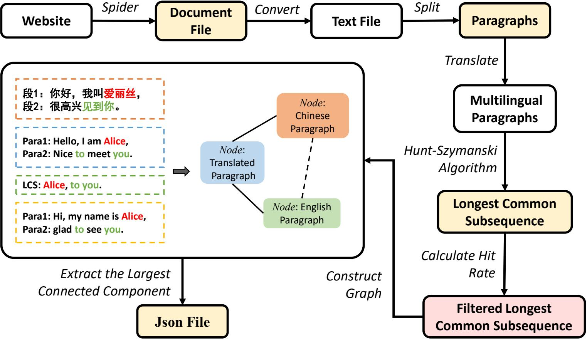

## Dependencies

We recommend using `Python 3.9+` over `Win10 21h2+`. `Office 2019` or newer must be installed.

```bash
cd scripts
pip install -r requirements.txt
```

### Standalone Workflow

This workflow is designed for users who want to run the entire pipeline on a single machine and are not primarily concerned with execution speed. The process involves running a sequence of Python scripts in the order defined in `scripts/new_sample_all.py`.

**1. Configuration**

Before running the scripts, you must configure the settings in `scripts/const.py`:

1.  Set `GET_LIST_FROM_YEAR` and `GET_LIST_TO_YEAR` to define the time range for the documents you want to crawl.
2.  Set `WINWORD_EXE` to the absolute path of your Microsoft Word executable (`WINWORD.EXE`).
3.  You can modify `WORK_DIR` and other output paths, but we recommend keeping the default settings to ensure consistency.

> **Pro Tip:** We suggest setting `GET_LIST_FROM_YEAR` and `GET_LIST_TO_YEAR` to the same year and running the entire pipeline iteratively. This allows you to process the data in manageable annual batches.

**2. Execution Steps**

Navigate to the `scripts` directory and run the following commands in order:

```bash
cd scripts

# 1. Crawl the list of document symbols for the specified year range.
py new_sample_get_list.py

# 2. Asynchronously download the .doc files based on the list from the previous step.
py new_sample_get_doc_async_candidate.py

# 3. Convert .doc files to .txt and generate the file-level aligned corpus (filewise_result.jsonl).
py new_sample_doc2txt.py

# 4. Translate the non-English text files into English, paragraph by paragraph.
py new_sample_txt2translate.py

# 5. Align the translated paragraphs with the English text using the GAPA algorithm. 
#    This generates the bilingual, paragraph-level corpus as a Hugging Face Dataset.
py new_sample_translate2align.py

# 6. Merge the bilingual alignments into a fully aligned, six-language corpus (blockwise_result.jsonl).
py new_sample_align2mergedjsonl.py
```

### Performance Bottleneck and Distributed Solution

The machine translation step (`new_sample_txt2translate.py`) is by far the most time-consuming and computationally intensive part of the pipeline, accounting for approximately **99.1%** of the total execution time.

To address this bottleneck, we have developed a distributed solution. We highly recommend this approach for users with access to:
*   Multiple machines or servers.
*   Servers with multi-socket CPUs.
*   Machines with multiple GPUs.
*   Cloud computing resources (e.g., GCP, AWS, Colab Pro).

The distributed architecture consists of a central server that distributes translation tasks to multiple clients.

**Setup and Execution**

1.  **Deploy the Task Server**:
    On a server that is accessible to all clients, run the task distribution server:
    ```bash
    py new_sample_txt2translate_distrib_candidate_server.py
    ```
    *   **Networking**: Before starting, ensure the `TRANSLATION_SERVER_PORT` in `const.py` is correctly configured and matches the port in the client scripts. If your clients are not on the same local network, you will need a server with a public IP or a port-forwarding solution like [nps](https://github.com/ehang-io/nps).
    *   **Storage**: The server must have sufficient storage space. Intermediate translation files are saved as uncompressed `pickle` objects and can be large.

2.  **Run Client Workers**:
    On each machine with available computing resources, run the client script to receive and process translation tasks:
    ```bash
    py new_sample_txt2translate_distrib_candidate_client.py
    ```

**Tips for Optimizing Client Performance:**

*   **GPU Acceleration**: To use a GPU, uncomment the line `os.environ['ARGOS_DEVICE_TYPE'] = 'cuda'` in the client script. For multi-GPU systems, you can specify a device (e.g., `cuda:0`, `cuda:1`). Since `argostranslate` may not fully saturate a powerful GPU, you can often run a CPU-based client instance alongside a GPU instance on the same machine.

*   **Multi-CPU Servers**: For servers with multiple CPU sockets, launch one client instance per socket to maximize hardware utilization.

*   **Google Colab**: We provide `new_sample_txt2translate_distrib_candidate_client_for_colab.ipynb` for easy use in Google Colab. Free-tier users can typically run multiple notebooks simultaneously, so you can duplicate the file to run several clients in parallel.

*   **Cloud VM Deployment**: For quick deployment on cloud VMs (GCP, AWS, etc.) or even in a `cloud shell`, you can use the `new_sample_txt2translate_distrib_candidate_deploy_debian12.sh` script. This script helps automate setup and execution. Please review the script before running, as you may only need to use specific parts of it for your environment. For example, our recommended Google Cloud machine configurations can be found in the README of the [bot-yaya/undl_en2zh_translation](https://huggingface.co/datasets/bot-yaya/undl_en2zh_translation) dataset.

When every translation task is done, **DO NOT FORGET TO FINALLY RUN `new_sample_txt2translate.py` ONCE**, since it will convert the translation cache produced at client into dataset for next step processing.

## Corpus Analysis and Statistics

### Document Structure and Temporal Scoping

The core organizational unit within the UN Digital Library (UNDL) relevant to parallel text is the document **"symbol"** (e.g., `A/RES/77/1`). As detailed in the [official UN documentation](https://research.un.org/en/docs/symbols), a symbol uniquely identifies a specific document, such as a resolution, a meeting record, or a working paper. Conceptually, a symbol acts as a container for the same document rendered in the UN's six official languages: Arabic (ar), Chinese (zh), English (en), French (fr), Russian (ru), and Spanish (es). This structure provides a natural source of high-quality, parallel data. However, the presence of all six language versions for any given symbol is not guaranteed; some symbols may have missing files for one or more languages.

Our initial data acquisition strategy involved programmatically crawling the sitemap index provided by the [UNDL](https://digitallibrary.un.org/sitemap_index.xml.gz). From this sitemap, we extracted a comprehensive list of document symbols. To define the temporal scope of our corpus, we filtered these symbols based on their **Release Time**, a timestamp indicating when a specific language file was made public. The collection period was defined from **January 1, 2000, to August 5, 2023**.

A significant challenge arose during our project: the UNDL's online platform and its underlying APIs underwent a substantial overhaul. This revision made our original data acquisition method non-reproducible. Specifically, re-crawling based on **Release Time** became infeasible for several reasons:

*   **Attribute Granularity**: `Release Time` is a file-level attribute, not a symbol-level one. This means different language versions of the same document could have different release times, complicating consistent temporal filtering.
*   **API Instability**: The new search API required to fetch `Release Time` proved unreliable for large-scale crawling, frequently returning `HTTP 429 Too Many Requests` errors.
*   **Search Imprecision**: The search endpoint often yielded imprecise matches, making it difficult to reliably associate a timestamp with a unique symbol.

To ensure the integrity of our statistical analysis, we adopted a more stable temporal metric: **Publication Time**. This attribute is a consistent, symbol-level property and is reliably accessible via the revised UNDL API.

> **Important Clarification**: The corpus dataset itself was curated using the original **Release Time** filter. However, all statistical analyses and charts presented here were generated by re-crawling the **Publication Time** for all symbols within our collected dataset. This ensures that the analysis is based on a stable and reproducible metric.

### Corpus Granularity Distribution

We analyzed the distribution of paragraphs per document and tokens per paragraph. The cumulative distribution charts below show that approximately 50% of documents contain 40 or fewer paragraphs, while approximately 80% of documents contain 137 or fewer paragraphs. Furthermore, approximately 80% of paragraphs consist of 75 or fewer tokens.

<div align="center">
  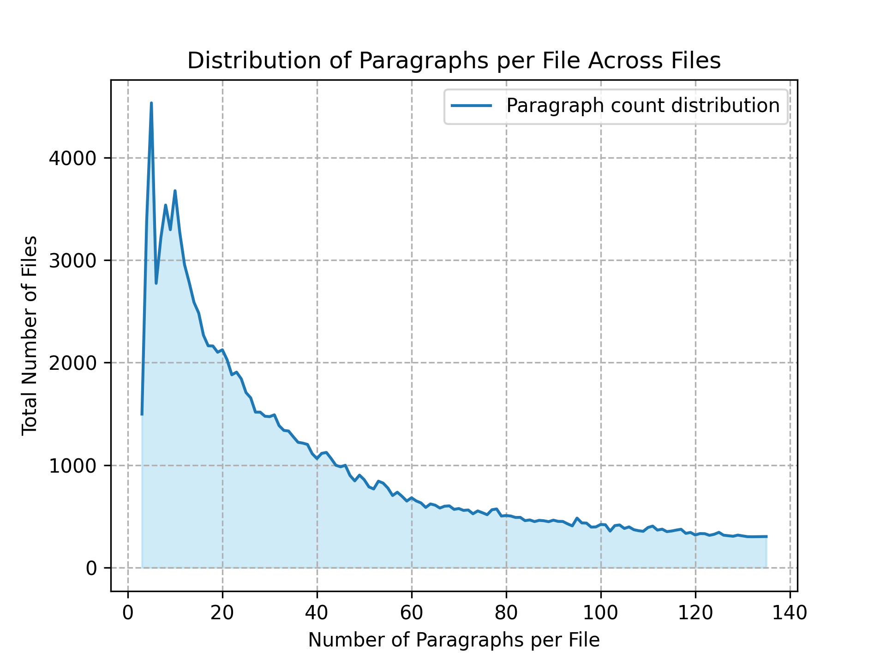
  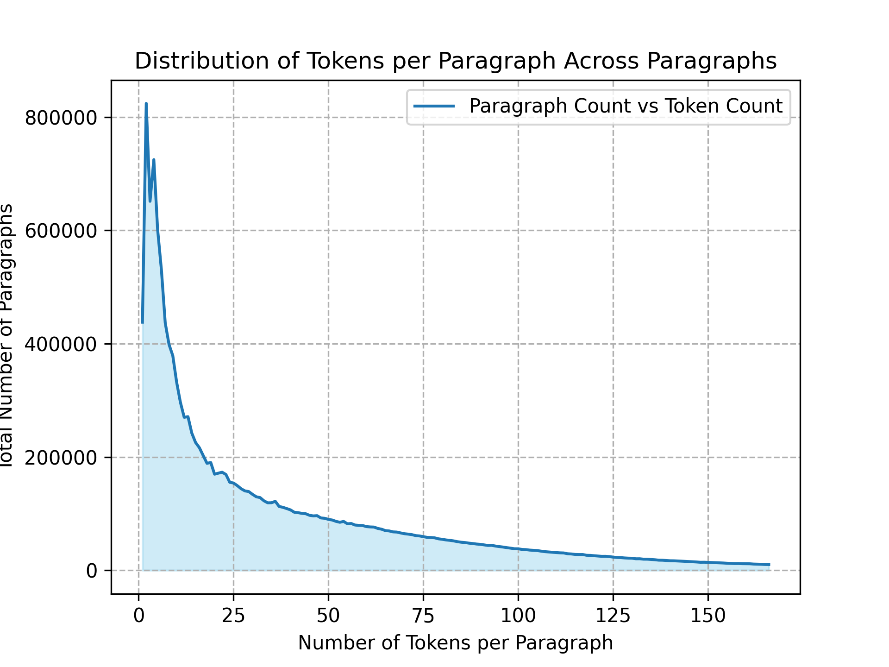
</div>
<p align="center"><em>Figure: Distributions of paragraph and token counts.</em></p>

<div align="center">
  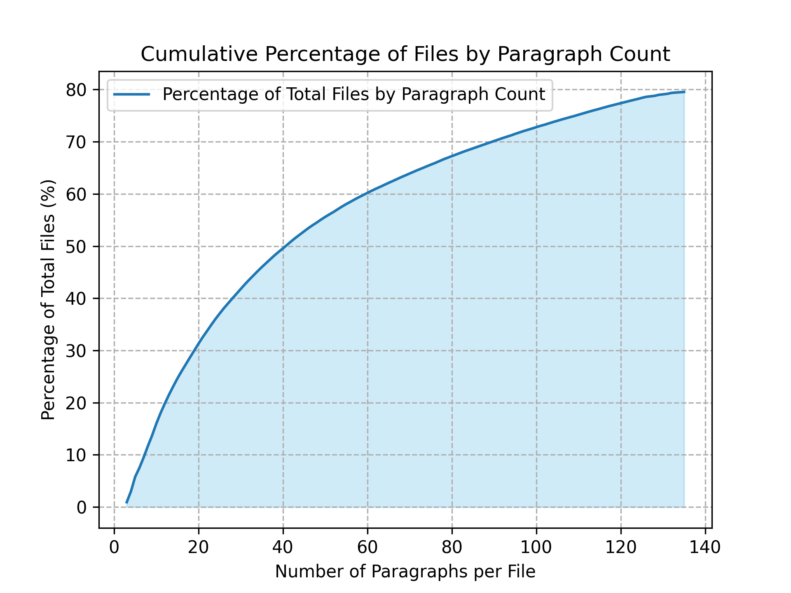
  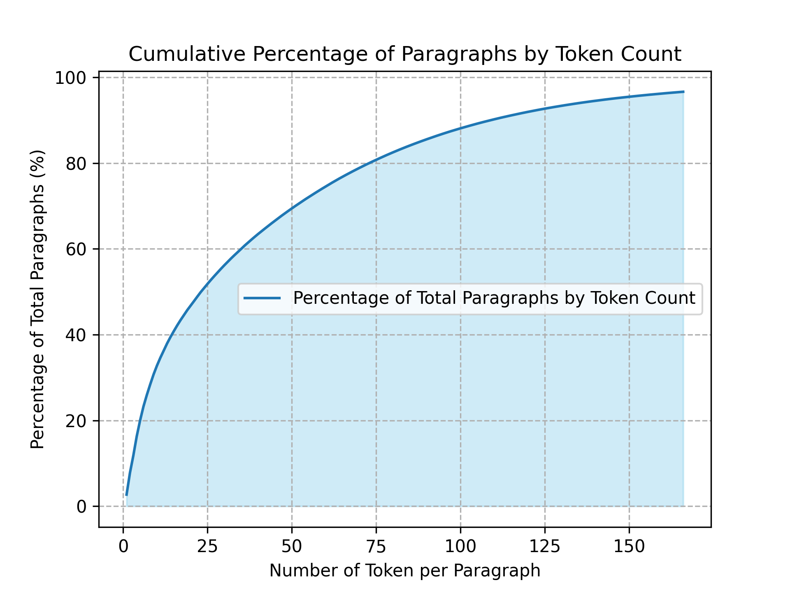
</div>
<p align="center"><em>Figure: Cumulative distributions for paragraphs per document and tokens per paragraph.</em></p>
### Language Distribution and Temporal Trends

To provide a comprehensive profile of our corpus, we conducted a series of analyses focusing on data distribution across languages and the temporal evolution of the corpus from 2000 to 2023.

The chart below illustrates the total number of documents collected for each language. Beyond the six primary UN languages, our corpus also includes a small number of German documents.

<div align="center">
  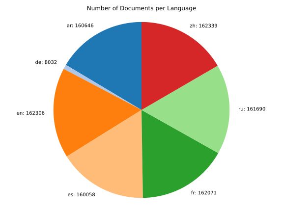
    <p align="center"><em>Figure: Number of Documents per Language across the entire corpus (2000-2023).</em></p>
</div>

The following charts provide a chronological overview, showing the number of unique document symbols per year and the number of files per language over the years.
<table>
  <tr>
    <td align="center" width="50%">
      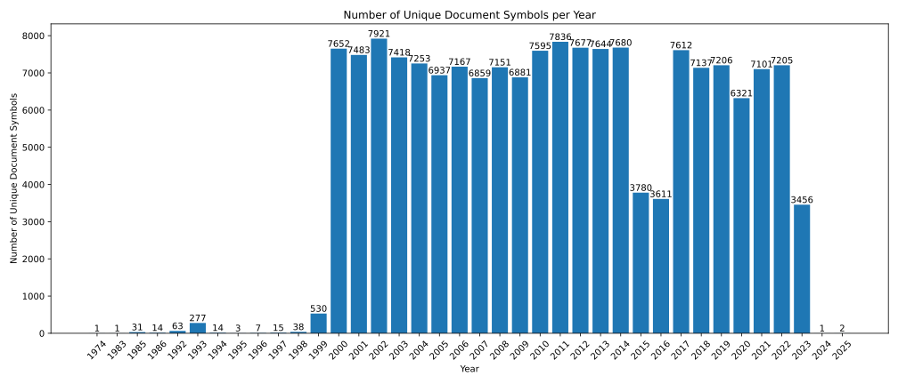<br>
      <p align="center"><em>Figure: Number of Unique Document Symbols per Year.</em></p>
    </td>
    <td align="center" width="50%">
      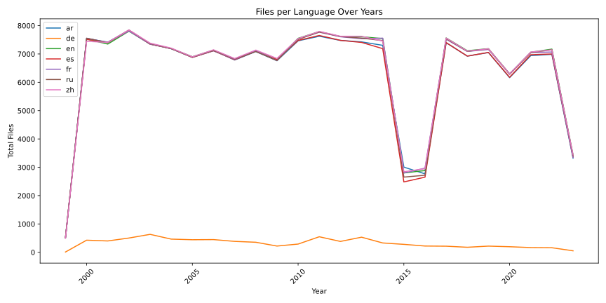<br>
      <p align="center"><em>Figure: Files per Language Over Years.</em></p>
    </td>
  </tr>
</table>
For a more granular view of data volume, we measured the annual counts of characters, words, and paragraphs for each language.

<table>
  <tr>
    <td align="center" width="33%">
      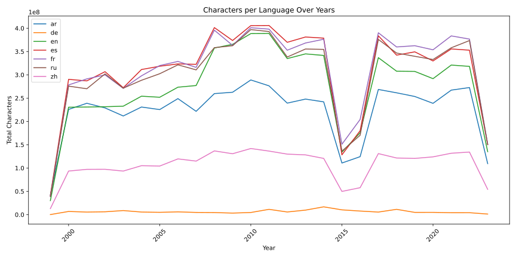<br>
      <p align="center"><em>Figure: Total Characters per Language Over Years.</em></p>
    </td>
    <td align="center" width="33%">
      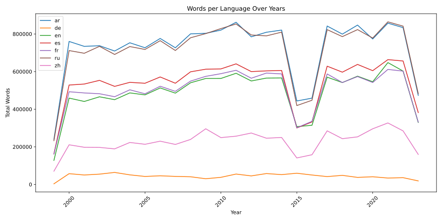<br>
      <p align="center"><em>Figure: Total Words per Language Over Years.</em></p>
    </td>
    <td align="center" width="33%">
      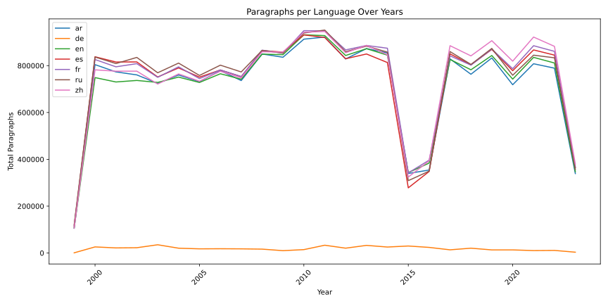<br>
      <p align="center"><em>Figure: Total Paragraphs per Language Over Years.</em></p>
    </td>
  </tr>
</table>

This analysis substantiates our rationale for selecting **paragraphs** as the alignment unit. Paragraph counts exhibit relative consistency across languages, and the segmentation criterion (two consecutive line breaks) is more straightforward than sentence-level alignment, which requires language-specific rules and complex anomaly handling.

### Data Completeness Analysis

A critical aspect of a real-world parallel corpus is its completeness. We define a *missing file* as an instance where a document symbol exists, but a file for a specific language was not available. The chart below quantifies this data sparsity, revealing that the 2015-2016 period had a higher incidence of missing files, particularly for Spanish and Russian.

<div align="center">
  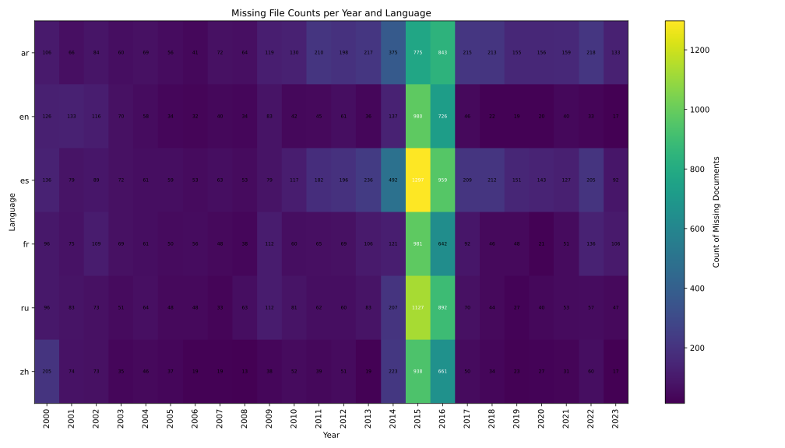
    <p align="center"><em>Figure: Missing File Counts per Year and Language.</em></p>
</div>

### Lexical Analysis

To offer a preliminary insight into the corpus's content, we identified the top 50 most frequent words in each language after converting text to lowercase and removing all punctuation.

<div align="center">
  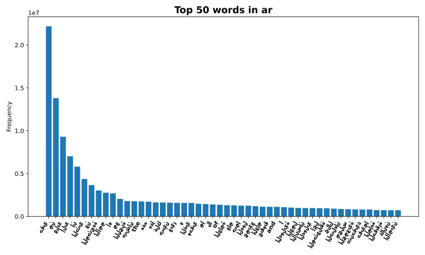
  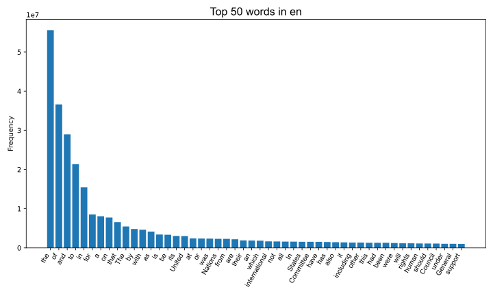
</div>
<p align="center"><em>Figure: Top 50 Most Frequent Words for Arabic and English.</em></p>

<div align="center">
  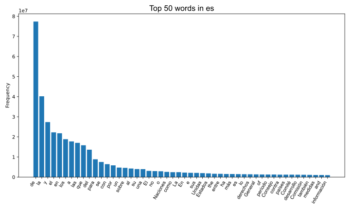
  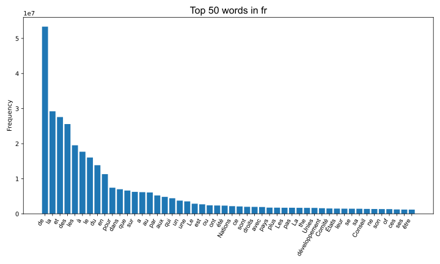
</div>
<p align="center"><em>Figure: Top 50 Most Frequent Words for Spanish and French.</em></p>

<div align="center">
  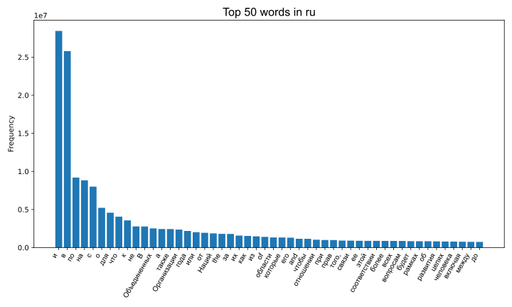
  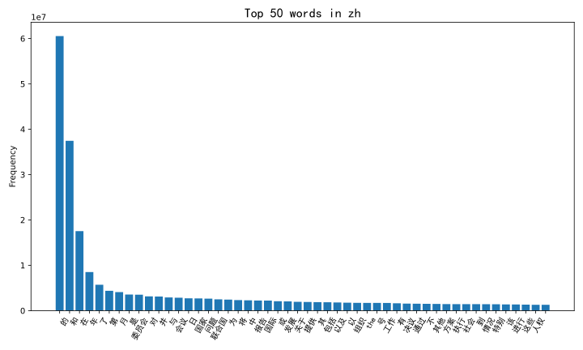
</div>
<p align="center"><em>Figure: Top 50 Most Frequent Words for Russian and Chinese.</em></p>

<div align="center">
  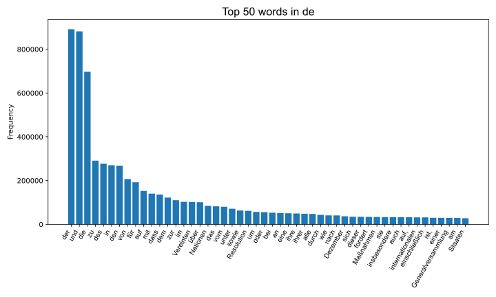
</div>
<p align="center"><em>Figure: Top 50 Most Frequent Words for German.</em></p>

## License and Availability

This project, including the entire data processing pipeline, is released under the **MIT License**.

The collected dataset, spanning from 2000 to 2023, is publicly available on [Hugging Face at `bot-yaya/rework_undl_text`](https://huggingface.co/datasets/bot-yaya/rework_undl_text). We hope this fosters transparency, ease of access, and the promotion of linguistic diversity within the machine learning community.

## Data Table Processing Workflow

To systematically remove large, noisy tables from documents and convert them into clean inline text suitable for alignment algorithms, we developed a multi-stage Python pipeline.

The pipeline proceeds as follows:

1.  **Document Conversion**:
    Raw `.doc` files are first converted to `.docx` using Microsoft Word via COM automation, then to plain text via Pandoc (`pandoc -t plain --wrap=none`). The process includes automatic handling of Word dialogs (e.g., repair or security prompts) to ensure robustness.

2.  **Character Preprocessing**:
    Zero-width and format-control characters (e.g., U+200E, soft hyphens) are stripped from the text to guarantee accurate line-width calculations for table parsing.

3.  **Table Detection and Flattening**:
    We identify and flatten three common ASCII-based table styles:
    *   *Multiline tables with explicit splitters*: Recognized by identical dash lines (`-----`) marking the header, splitter, and footer.
    *   *Multiline tables without explicit splitters*: Similar to the above, but only top and bottom delimiters are present.
    *   *ASCII grid tables*: Bordered by `+---+` and vertical bars (`|`).

4.  **Recursive Replacement**:
    A main routine iteratively applies the detectors. All detected tables are replaced by inline text segments, where each table row becomes a single line of space-separated cell contents in row-major order.

5.  **Output Generation**:
    The flattened, table-free paragraphs are saved to a dedicated output directory, providing clean text for downstream multilingual alignment.

[This entire procedure](https://github.com/mnbvc-parallel-corpus-team/UPRPRC/blob/main/scripts/new_sample_doc2txt.py) effectively removes bulky table noise while preserving semantic content in a linearized form suitable for text-processing algorithms.


# UPRPRC 中文说明

本仓库是 [MNBVC](https://github.com/esbatmop/MNBVC) 平行语料小组的，生产来自 [United Nations Digital Library](https://digitallibrary.un.org/) 文件的6国语言平行语料的管线脚本。

本管线涵盖了以下步骤：

1. 从搜索系统中按年份爬取所有文件的列表
2. 下载会议文件
3. 将文件转换为文本，输出文件级对齐语料
4. 对不同语言间的文本文件进行段落级对齐，输出双语段落级对齐语料
5. 对双语段落级语料进行合段，输出全语种段落级对齐语料

成品语料: 

- [https://huggingface.co/datasets/liwu/MNBVC/tree/main/parallel/united_nations/20230240](https://huggingface.co/datasets/liwu/MNBVC/tree/main/parallel/united_nations/20230240)
- [https://huggingface.co/datasets/liwu/MNBVC/tree/main/parallel/united_nations/20250102](https://huggingface.co/datasets/liwu/MNBVC/tree/main/parallel/united_nations/20250102)
- [https://huggingface.co/datasets/bot-yaya/rework_undl_text](https://huggingface.co/datasets/bot-yaya/rework_undl_text)
- [https://huggingface.co/datasets/bot-yaya/undl_ar2en_aligned](https://huggingface.co/datasets/bot-yaya/undl_ar2en_aligned)
- [https://huggingface.co/datasets/bot-yaya/undl_de2en_aligned](https://huggingface.co/datasets/bot-yaya/undl_de2en_aligned)
- [https://huggingface.co/datasets/bot-yaya/undl_es2en_aligned](https://huggingface.co/datasets/bot-yaya/undl_es2en_aligned)
- [https://huggingface.co/datasets/bot-yaya/undl_fr2en_aligned](https://huggingface.co/datasets/bot-yaya/undl_fr2en_aligned)
- [https://huggingface.co/datasets/bot-yaya/undl_ru2en_aligned](https://huggingface.co/datasets/bot-yaya/undl_ru2en_aligned)
- [https://huggingface.co/datasets/bot-yaya/undl_zh2en_aligned](https://huggingface.co/datasets/bot-yaya/undl_zh2en_aligned)


## 管线总览


## 安装依赖

我们推荐在一台装有 `Python 3.9+` 的 `Win10 21h2+` 机器上运行整条管线。管线会用到 `Office` ，确保安装有2019或更新版本。

```bash
cd scripts
pip install -r requirements.txt
```

## 管线执行

### 单机用例

对于那些只是希望完整把整条管线运行起来，不在乎生产效率的单机用户，可以遵照 [scripts/new_sample_all.py](scripts/new_sample_all.py) 里定义的执行顺序，一步步按顺序执行这些py脚本。

首先修改 [scripts/const.py](scripts/const.py) 文件。

1. 将 `GET_LIST_FROM_YEAR` 和 `GET_LIST_TO_YEAR` 分别设置成想要爬取的文件的年份。
2. 将 `WINWORD_EXE` 设置为实际的 `WORD` 可执行文件路径。
3. 如果你想要修改中间文件的输出目录，可以修改 `WORK_DIR` 以及所有依赖它的文件路径，但我们不推荐修改这些配置。

> 我们建议将 `GET_LIST_FROM_YEAR` 和 `GET_LIST_TO_YEAR` 两个变量设置成相同年份，对每一年重复执行整个管线，以达到年份分批的目的。

```bash
cd scripts
# 根据给定的 GET_LIST_FROM_YEAR 和 GET_LIST_TO_YEAR ，爬取对应年份的文件列表
py new_sample_get_list.py

# 根据上一步得到的列表，批量下载 doc 文件
py new_sample_get_doc_async_candidate.py

# 将上一步得到的 doc 文件批量转换成 txt ，同时生成文件级对齐的 filewise_result.jsonl 语料
py new_sample_doc2txt.py

# 将上一步得到的 txt 的非英语语种文件按段落翻译成英语
py new_sample_txt2translate.py

# 将上一步得到的翻译将非英语语种和英语文本做对齐，应用 GAPA 算法，同时生成双语段落级对齐的 alresult_dataset 语料。注意它是 huggingface dataset 文件
py new_sample_translate2align.py

# 将上一步得到的双语段落级对齐语料连边合段，做成6国语言对齐的 blockwise_result.jsonl
py new_sample_align2mergedjsonl.py

```

### 效率瓶颈及其优化方案

文本翻译是整条管线中，最耗时、耗费算力的一个步骤，大约占了整条管线执行耗时的 99.1% 。所以我们针对性地对其做了分布式优化。

我们推荐拥有多台机器、拥有安装有多路CPU的服务器、拥有安装有多块独立显卡的机器、拥有多台云服务器或者 colab 付费计划的用户执行 `py new_sample_txt2translate_distrib_candidate_server.py` 来部署翻译任务分发服务器，并且在算力富余的机器上面运行 `py new_sample_txt2translate_distrib_candidate_client.py` 来分布式执行机翻，以分担 `new_sample_txt2translate.py` 这一步骤的任务，缩短整个翻译步骤带来的时间开销。

根据我们在 2023 年的实践，我们给出针对分布式机翻这一步的推荐部署方案。谷歌云机器配置选择推荐可以参见 [bot-yaya/undl_en2zh_translation](https://huggingface.co/datasets/bot-yaya/undl_en2zh_translation) 的 README 部分。

- 分布式任务执行之前，确定好 `const.py` 里配置的 `TRANSLATION_SERVER_PORT` ，并且同步修改 `new_sample_txt2translate_distrib_candidate_client.py` 及其衍生脚本里写死的端口号，以使其匹配。
- 选一台能够方便访问到的服务器，执行 `py new_sample_txt2translate_distrib_candidate_server.py` 以部署任务分发服务器。如果你并非在局域网内部署整套系统，又没有公网ip，你可能需要自己准备一台有公网ip的云服务器或一套端口转发方案。注意确保这台服务器的储存空间够用，翻译步骤的中间文件是没有压缩过的 `pickle` 序列化文件。我们在跑 2000-2023 年的数据时是用了一台腾讯云服务器和 [nps](https://github.com/ehang-io/nps) 做反代。
- [argos-translate](https://github.com/argosopentech/argos-translate) 既可以在CPU上运行，也可以在GPU上运行。对于安装有独立显卡的机器，可以反注释掉 `new_sample_txt2translate_distrib_candidate_client.py` 的 `os.environ['ARGOS_DEVICE_TYPE'] = 'cuda'` 这步来使用 cuda。如果有多块显卡，可以写成 `cuda:0` 这种形式来指定设备号。这些机器在使用显卡执行翻译任务的同时，还可以多执行一个使用cpu翻译的实例。`argostranslate` 并不能完全榨干显卡的算力，并且有时会有cpu翻译节点比gpu快的情况。
- 对于多路CPU的服务器，有几路CPU就启几个 `new_sample_txt2translate_distrib_candidate_client` 。否则其它路上的CPU不能被利用
- 对于 google 账号比较多、或者 colab 的付费用户，我们准备了 `new_sample_txt2translate_distrib_candidate_client_for_colab.ipynb` 脚本。这是一个在 google colab 环境中即开即用的 `jupyter notebook` 文件。注意每个免费用户可以同时执行3个任务，请复制3份这个文件来使用。
- 对于在 [Google Cloud Platform](https://cloud.google.com/) 或者其它云服务商上有多台虚拟机实例的用户，我们准备了 `new_sample_txt2translate_distrib_candidate_deploy_debian12.sh` 脚本，方便直接在对应环境中执行一键命令直接令当前机器参与翻译。甚至是谷歌云或者阿里云的 `cloud shell` 中你都能利用这个脚本直接执行翻译任务。但注意不要直接执行这个脚本，你可以打开这个脚本有选择的使用前半部分或者后半部分。
- 在 server 已经没有任务可以下发后，**别忘了在最后执行一次** `new_sample_txt2translate.py` ，它会把翻译完成的文本 pickle 缓存做成能够给管线的下一步使用的 dataset。
